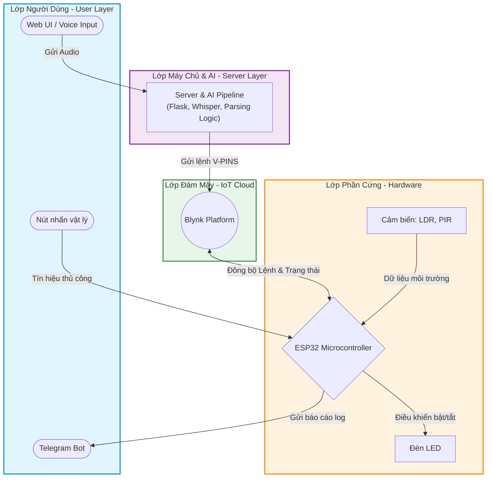

# Smart Lighting (ESP32 + Blynk + Voice AI)

Hệ thống **điều khiển đèn thông minh** dùng **ESP32** (PlatformIO/Arduino) kết hợp:

- **Blynk Cloud** để điều khiển/đồng bộ trạng thái từ xa
- **Cảm biến LDR** (tự bật/tắt theo ánh sáng)
- **Cảm biến PIR** (tự bật khi phát hiện chuyển động và giữ sáng một khoảng thời gian)
- **Nút nhấn vật lý** (override chế độ cảm biến)
- **Telegram Bot** để gửi thông báo theo sự kiện
- **Voice AI (Whisper tiếng Việt)** + **Flask** + **Web UI** để ra lệnh bằng giọng nói (bật/tắt/tự động)

## Demo nhanh

- Chạy firmware lên ESP32 (hoặc Wokwi)
- Chạy server AI: `python server.py`
- Mở trang web tại `http://localhost:5000/` (hoặc URL **ngrok** in trong terminal)
- **Nhấn giữ nút mic** và nói: “Bật đèn phòng ngủ”, “Tắt đèn hành lang”, ...

## Kiến trúc



## Tính năng

- Điều khiển **đèn phòng ngủ (LED1)** bằng Blynk / giọng nói / nút vật lý
- Điều khiển **đèn hành lang (LED2)** tự động theo **LDR**
  - Có **override** bằng nút hoặc giọng nói (tạm ngưng chế độ cảm biến)
- Điều khiển **đèn sân vườn (LED3)** tự động theo **PIR**
  - Khi có chuyển động: bật và **giữ sáng** `PIR_HOLD_MS` (mặc định 10s)
  - Có **override** bằng nút hoặc giọng nói
- Gửi **Telegram** khi:
  - Có thay đổi trạng thái đèn
  - LDR/PIR kích hoạt tự động
  - Override thủ công
- Web UI tối giản: nhấn giữ để ghi âm → AI nhận dạng → gửi lệnh

## Mapping phần cứng (GPIO)

Theo [src/main.cpp](src/main.cpp):

| Thiết bị | Chân ESP32 |
|---|---:|
| LED1 (Phòng ngủ) | GPIO 26 |
| LED2 (Hành lang) | GPIO 27 |
| LED3 (Sân vườn) | GPIO 14 |
| LDR (ADC) | GPIO 34 |
| PIR (Digital) | GPIO 35 |
| Nút 1 (LED1) | GPIO 18 |
| Nút 2 (LED2) | GPIO 19 |
| Nút 3 (LED3) | GPIO 23 |

## Mapping Blynk Virtual Pin

Firmware sử dụng các Virtual Pin sau:

- `V0`: điều khiển LED1 (phòng ngủ)
- `V1`: đồng bộ trạng thái LED2 (hành lang)
- `V2`: đồng bộ trạng thái LED3 (sân vườn)
- `V3`: gửi giá trị LDR (để quan sát trên Blynk)
- `V4`: lệnh Voice AI cho LED2 (0=Tắt, 1=Bật, 2=Trả về tự động)
- `V5`: lệnh Voice AI cho LED3 (0=Tắt, 1=Bật, 2=Trả về tự động)
- `V9`: log trạng thái

## Cấu trúc thư mục

```
.
├─ src/                # Firmware ESP32 (PlatformIO/Arduino)
│  └─ main.cpp
├─ server.py            # Flask server + Whisper ASR + Ngrok
├─ index.html           # Web UI (được server.py serve tại /)
├─ requirements.txt     # Python dependencies
├─ platformio.ini       # Cấu hình PlatformIO + lib Blynk
├─ diagram.json         # Mạch Wokwi
└─ wokwi.toml           # Trỏ firmware build output cho Wokwi
```

## Yêu cầu

### Firmware
- VS Code + PlatformIO Extension
- Board: `esp32dev` (ESP32 DevKit)

### Server AI
- Python 3.10+ (khuyến nghị)
- Cài dependency theo [requirements.txt](requirements.txt)
- Máy có GPU (CUDA) sẽ nhanh hơn; nếu không có GPU, server tự chạy CPU

## Cài đặt & chạy

### 1) Build/flash ESP32 (PlatformIO)

Mở project bằng VS Code (PlatformIO), sau đó:

- Build: `pio run`
- Upload: `pio run -t upload`
- Serial monitor: `pio device monitor -b 115200`

Thiết bị kết nối WiFi theo cấu hình trong [src/main.cpp](src/main.cpp) (mặc định: `Wokwi-GUEST`).

### 2) Chạy server giọng nói (Flask + Whisper)

Tại thư mục project:

```bash
python -m venv .venv
# Windows:
.\.venv\Scripts\activate
pip install -r requirements.txt
python server.py
```

Server sẽ:

- Serve UI tại `http://localhost:5000/`
- In ra **URL ngrok HTTPS** để mở trên điện thoại (microphone thường yêu cầu HTTPS)

### 3) Dùng Web UI

- Mở `http://localhost:5000/` (hoặc URL ngrok)
- Nhấn giữ nút 🎙️ và nói lệnh
- UI sẽ hiển thị câu nhận dạng + phản hồi

## API (server.py)

- `GET /` → trả về trang [index.html](index.html)
- `POST /transcribe` (multipart form-data, field `audio`) → nhận dạng giọng nói và gửi lệnh lên Blynk
- `GET /status` → thông tin server/model/device/ngrok

Ví dụ response `/transcribe` (rút gọn):

```json
{
  "text": "bật đèn phòng ngủ",
  "action": 1,
  "pins": ["V0"],
  "success": true,
  "message": "✅ Đã BẬT 💡 Đèn phòng ngủ"
}
```

## Lệnh giọng nói hỗ trợ

Server parse lệnh theo từ khóa (tiếng Việt có/không dấu), ví dụ:

- Bật: “bật”, “mở”, “on”, “sáng”, ...
- Tắt: “tắt”, “đóng”, “off”, “tối”, ...
- Trả về tự động: “tự động”, “cảm biến”, “auto”, “mặc định”, ...

Đối tượng:

- “phòng ngủ” → `V0`
- “hành lang” → `V4`
- “sân vườn” → `V5`
- “tất cả” → gửi đồng thời tới tất cả pin cấu hình

## Mô phỏng Wokwi

Repo đã có [diagram.json](diagram.json) và [wokwi.toml](wokwi.toml) để chạy mô phỏng.

Luồng thường dùng:

1. Build firmware bằng PlatformIO (`pio run`)
2. Mở project bằng Wokwi (VS Code Extension hoặc Wokwi web)
3. Wokwi dùng file `.pio/build/esp32dev/firmware.elf/.bin` theo `wokwi.toml`

## Lưu ý bảo mật (rất quan trọng khi upload GitHub)

Hiện tại các token (Blynk / Telegram / Ngrok) đang được hard-code trong code:

- [src/main.cpp](src/main.cpp)
- [server.py](server.py)

Trước khi public repo, nên:

- **Thu hồi/rotate token cũ** và tạo token mới
- Chuyển token sang biến môi trường hoặc file `secrets.*` và thêm vào `.gitignore`

## Troubleshooting

- Microphone không hoạt động trên trình duyệt: ưu tiên dùng **URL ngrok HTTPS** (HTTP thường bị chặn mic)
- Server lần đầu chạy tải model khá lâu: chờ download model Whisper
- ESP32 không phản hồi lệnh: kiểm tra WiFi, token Blynk, và Virtual Pin mapping

---

Nếu bạn muốn, mình có thể:
- Chuẩn hóa phần **secrets** (đưa token ra `.env`) và cập nhật `.gitignore` để an toàn khi public.
